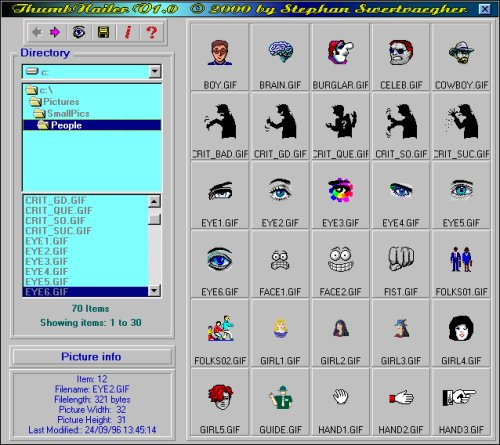



## ThumbNailer V1\.0

### Description

With this app you can quickly view a directory with pictures (.bmp, .gif, .jpg, .ico, .wmf). All pictures are listed as thumbnails. You can also view a thumbnail in its original size, reduced or enlarged (from 25% till 300%). You can browse in a directory to view all the picture files, no matter how large the directory is. Picture info is also displayed (width, height, file-length,...). On my 650 MHz Pentium II it works very fast - fill the thumbnails in about 1 - 2 seconds. The slowest are the Jpg-files, but it's still OK. This program uses a lot of API-calls, such as API-popupmenus, transparent form, etc...

A helpfile is included and can be called from within the program.
 
### More Info
 

             |
---                |---
**Submitted On**   |2000-12-09 23:54:30
**By**             |[stephane swertvaegher](https://github.com/Planet-Source-Code/PSCIndex/blob/master/ByAuthor/stephane-swertvaegher.md)
**Level**          |Advanced
**User Rating**    |5.0 (25 globes from 5 users)
**Compatibility**  |VB 5\.0, VB 6\.0
**Category**       |[Complete Applications](https://github.com/Planet-Source-Code/PSCIndex/blob/master/ByCategory/complete-applications__1-27.md)
**World**          |[Visual Basic](https://github.com/Planet-Source-Code/PSCIndex/blob/master/ByWorld/visual-basic.md)
**Archive File**   |[CODE\_UPLOAD125101292000\.zip](https://github.com/Planet-Source-Code/stephane-swertvaegher-thumbnailer-v1-0__1-13462/archive/master.zip)

